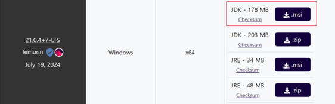
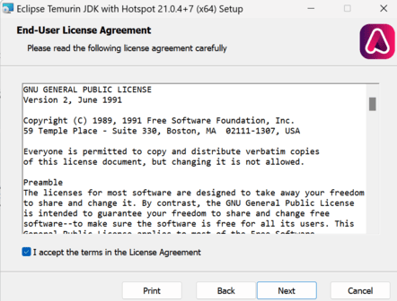

## 🤖 윈도우 환경에  JDK 설치
### 📃 JDK의 종류 
자바 프로그램을 개발하고 실행하기 위해서는 먼저 Java SE의 구현체인 JDK를 설치해야 한다. JDK에는 Open JDK와 Oracle JDK가 있다. 
> 🔩`Java SE (Java Standard Edition)` : Java 표준판이 가져야 할 스펙을 정의한 것   
> 🔩 `JDK (Java Development Kit)` : Java SE를 구현해서 만든 것. 
>   
> 
>   
> 💡 `Oracle JDK`는 `Open JDK`보다 **응답성과 JVM 성능이 상대적으로 뛰어나다.**
> -  하지만, Open JDK도 성능이 지속적으로 향상되고 있으며, 안정화도 이루어지고 있기 때문에, ***JDK 비용적 측면을 고려한다면, Open JDK를 사용하는 것이 유리하다.*** 

 

### 🎱 JDK의 다운로드 사이트 
🔎 `Open JDK` : https://adoptium.net/  
🔎 `Oracle JDK` : https://www.oracle.com/java/technologies/downloads/
> 💡 adoptium 사이트는 이클립스 재단에서 관리하고 있고, 다양한 운영체제용 JDK와 LTS 버전을 제공한다, 
> -  ***LTS (Long Term Support) 버전*** : 장기간 기술 지원을 받을 수 있다는 뜻으로, 다른 버전들보다 안정적으로 사용할 수 있다. (LTS 제공 버전 : JDK8, 11, 17, 21) 

 

---

### ⚙️ Open JDK 설치  
https://adoptium.net/temurin/releases/ 에서 **msi 버전**으로 설치한다. 

 

### ⚙️ 윈도우 환경에 설치 방법
① 다운로드 한 msi 파일을 클릭하여 jdk를 설치한다. 첫 설정 페이지는 Next를 눌러 넘어간다. 

 

② 라이선스 동의 여부 창에 동의를 체크한 후 Next를 눌러 넘어간다. 

 

③ 현재 설치할 기기에 모든 유저에게 설치할지 hyedi3x 계정(현재 사용 계정)에만 설치할지 결정한다. 

> 자바 버전은 맞추는 게 좋기에 all user로 선택한다. 

 

④ JDK 설치 옵션을 커스텀 할 수 있다. 기본 세팅으로 설정하고 설지 Location만 변경 후에 Next를 눌러 넘어간다. 

>  Location : C:\Program Files\Java\jdk-21.0.4.7-hotspot\
> -  `Modify PATH variable` : PATH 환경 변수를 수정하겠다는 기본 옵션 
> -  `Associate .jar` : 관련 라이브러리 .jar 파일을 설치하겠다는 기본 옵션
> -  `Set or override JAVA_HOME variable` : JAVA_HOME을 임의적으로 setting하겠다는 옵션 (비활성화가 기본 옵션) 
> -  `JavaSoft (Oracle) registry keys` : Oracle registry keys를 설치하겠다는 옵션  (비활성화가 기본 옵션)

 

⑤ Install을 클릭하여 설치를 마무리한다. 

 

---

### 📃 JVM / JRE / JDK
💻  `JVM (Java Virtual Machine)` : 자바의 실행 환경을 만들어 준다. 
> 🪄 자바를 실행할 수 있는 기본이 되는 코어 프로그램이다.  

  

💻 `JRE (Java Runtime Environment)` : JVM 코어 프로그램을 기반으로 사용자가 Java를 실행하기 위해 필요한 도구들의 모음을 말한다.
> 🪄 JVM과 자바 프로그램의 실행에 필요한 시스템 라이브러리 ex. 자바 클래스 라이브러리, 자바 명령, 인프라 등이 포함되어 있다.  
> 🪄 일반사용자(비 개발자)들에게 Java 프로그램 이용 환경을 제공한다. 
> 🪄 JVM을 기반하여 프로그램 전반의 실행 및 운영을 관장(사용 및 실행에 포커스)  

  

💻 `JDK (Java Development Kit)`  : Java 프로그램을 개발하는 개발자를 중심으로 만들어진 도구의 집합이다. 
> 🪄자바 프로그램을 작성하고, 컴파일할 수 있는 도구가 포함되어 있다.  
> 🪄개발자가 자바 프로그램을 개발해야 할 경우 반드시 JDK를 설치하여 개발을 진행해야 한다.  

  
