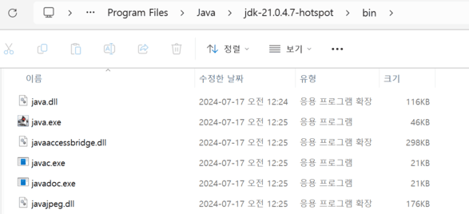

## 🤖 윈도우 환경에  환경 변수 설정 
### ✒️ 운영체제별 환경 변수를 설정해야 하는 이유  
`운영체제`는 프로그램들이 실행하면서 사용할 수 있는 값들을 **환경 변수 이름으로 관리**한다. JDK를 설치하고 나면 ***프로그램들이 JDK를 이용할 수 있도록 JAVA_HOME 환경 변수를 생성***하고, ***Path 환경 변수를 수정하는 것이 좋다.*** 
> ⛏️ `JAVA_HOME` : JDK 설치 경로로 연결하는 환경 변수를 생성한다.  
> ⛏️ `Path` : 다양한 개발 프로그램 경로들을 모아둔 환경 변수이다. 

### ⚙️ 윈도우 환경 변수 설정 
① 윈도우 검색창에 [시스템 환경 변수 편집]을 검색한다. 
> 🪄 [시스템 속성] - [고급] - [환경 변수] 
> 

 

② [환경 변수] 대화상자에서 [시스템 변수]의 [새로 만들기]를 클릭한다. 
> 

> [새 시스템 변수] 
> 
> -🪄  [변수 이름] : JAVA_HOME
> - 🪄 [변수 값] : C:\Program Files\Java\jdk-21.0.4.7-hotspot

 

③ JDK 설치 폴더인 C:\Program Files\Java\jdk-21.0.4.7-hotspot 폴더에 들어가면, bin 디렉터리가 있다. 
> 
>💡 `bin 폴더`  : 자바 소스 파일을 컴파일해 주는 javac.exe와 자바프로그램을 실행해 주는 java.exe 명령어가 있다. 

 

④ javac와 java 명령어가 bin 폴더에 있지만, 어떤 위치에서도 사용될 수 있도록. Path 환경 변수에 경로를 추가한다. 
> 
> 🪄 [시스템 변수] - Path(선택) - [편집] : [새로 만들기] - %JAVA_HOME%\bin 입력
> 🪄 생성된 변수 값을 맨 위로 이동시킨다. 명령어는 Path 환경변수에 등록된 순서대로 찾기 때문이다. 

 

⑤ 환경 변수가 올바르게 설정되었는지 확인하기 위해 명령 프롬프트(cmd)를 실행하고, javac 명령어와 java 명령어를 입력한다. 
> 